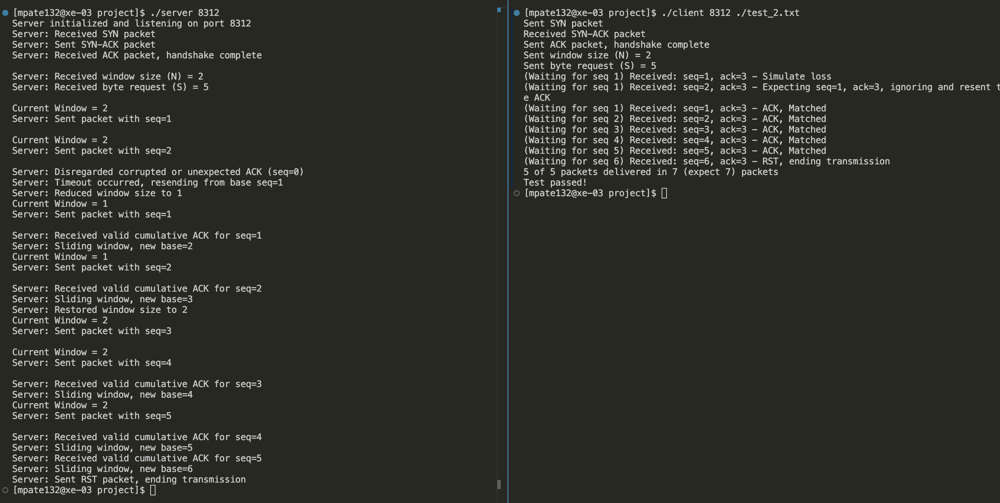

# Go-Back-N UDP Implementation
### Developed by Mahir Patel

This report outlines the steps required to set up and run the Go-Back-N protocol implementation, along with a detailed explanation of how the protocol works and how the program handles specific scenarios.

---

## Table of Contents
1. [Introduction](#introduction)
2. [Cloning the Repository](#cloning-the-repository)
3. [Compiling the Code](#compiling-the-code)
4. [Running the Server and Client](#running-the-server-and-client)
5. [Go-Back-N Protocol Overview](#go-back-n-protocol-overview)
6. [Program Features and Behavior](#program-features-and-behavior)
7. [Test Cases](#test-cases)
8. [Conclusion](#conclusion)
9. [Example Output](#example-output)

---

## Introduction
The Go-Back-N protocol is a reliable data transfer protocol that uses a sliding window mechanism to send multiple packets over an unreliable network. This project implements the Go-Back-N protocol using UDP (User Datagram Protocol) to simulate reliable packet delivery while handling:
- Packet loss
- Corrupted acknowledgments (ACKs)
- Timeout retransmissions
- Sliding window updates

This implementation features a **server** that transmits data packets and a **reference client** that sends simulated ACKs based on test files.

---

## Cloning the Repository
To access the source code, clone the GitHub repository to your local machine:

```bash
git clone https://github.com/MahirPatel3130/go-back-n.git
cd go-back-n
```

## Compiling the code
```bash
gcc server.c -o server
gcc reference_client.c -o client
```

## Running the Server and Client
### Step 1. Start the server
In the first terminal, run the server program and specify the listening port (e.g., 8312):
```bash
./server 8312
```

### Step 2. Run the Client
In the second terminal, run the client program with the server's port and a test case file (e.g., test_1.txt):
```bash
./client 8312 ./test_<number from 1 to 11>.txt
```

### Step 3. Observer the Output
- The server and client will log the packets sent, acknowledgments received, and retransmissions.
- Ensure that the number of packets sent and delivered matches the expected results.

## Go-Back-N Protocol Overview
The Go-Back-N protocol ensures reliable data delivery over an unreliable network. Here's how it works:

1. **Sliding Window:**
    - The sender maintains a window of packets that can be sent without waiting for an acknowledgment (ACK).
    - The window slides forward as ACKs are received.

2. **Cumulative Acknowledgments:**
    - The receiver sends an ACK for the highest sequence number received in order.
    - Any gaps in the sequence (due to loss or corruption) are ignored.
    
3. **Timeout and Retransmission:**
    - If the sender does not receive an ACK within a specified timeout, it retransmits all packets from the base of the window.
    
4. **Handling Corrupted ACKs:**
    - Corrupted or duplicate ACKs are ignored by the sender.

## Program Features and Behavior
This implementation includes the following key features:

1. **Three-Way Handshake**:
    - The client initiates the connection by sending a SYN packet to the server.
    - The server responds with a SYN-ACK packet, acknowledging the client's request.
    - The client completes the handshake by sending an ACK packet back to the server.

2. **Packet Transmission**:
    - The server sends packets within the current window size, each containing a sequence number, flag, and payload.
    - The sequence numbers ensure proper ordering and tracking of packets.

3. **Corrupted ACK Handling**:
    - The server discards any corrupted or unexpected ACKs received from the client.
    - Only valid cumulative ACKs are processed to slide the window forward.

4. **Timeout and Retransmissions**:
    - If a timeout occurs due to a missing ACK, the server retransmits all unacknowledged packets starting from the base of the window.
    - The window size is halved on timeout to adjust for potential network issues.

5. **Window Restoration**:
    - If two consecutive successful windows (with no packet loss or corruption) are achieved, the server restores the window size to its initial value.
    - This ensures optimal use of the network's capacity when conditions improve.

## Test Cases
The repository includes 11 test cases (`test_1.txt` to `test_11.txt`) to evaluate the implementation. Each test simulates different scenarios:

1. **Packet Loss**:
    - The server handles situations where one or more packets are lost during transmission.
    - Upon detecting the loss (via timeout), the server retransmits the unacknowledged packets starting from the base of the window.

2. **Corrupted ACKs**:
    - The server discards corrupted or duplicate ACKs received from the client.
    - Only valid cumulative ACKs are used to slide the window forward.

3. **Timeout and Retransmission**:
    - If an acknowledgment is not received within the timeout period, the server retransmits all packets from the base of the window.
    - The window size is halved upon timeout to adapt to potential network congestion.

4. **Cumulative ACKs**:
    - The client acknowledges the highest sequence number received in order.
    - The server correctly interprets cumulative ACKs to slide the window forward, even if individual ACKs for intermediate packets are not received.

## Conclusion
This implementation of the Go-Back-N protocol demonstrates reliable data transfer over an unreliable UDP network. By handling cumulative ACKs, corrupted ACKs, and retransmissions, it ensures all packets are delivered successfully. Use the provided test cases to verify the implementation under different network conditions.

## Example Output



